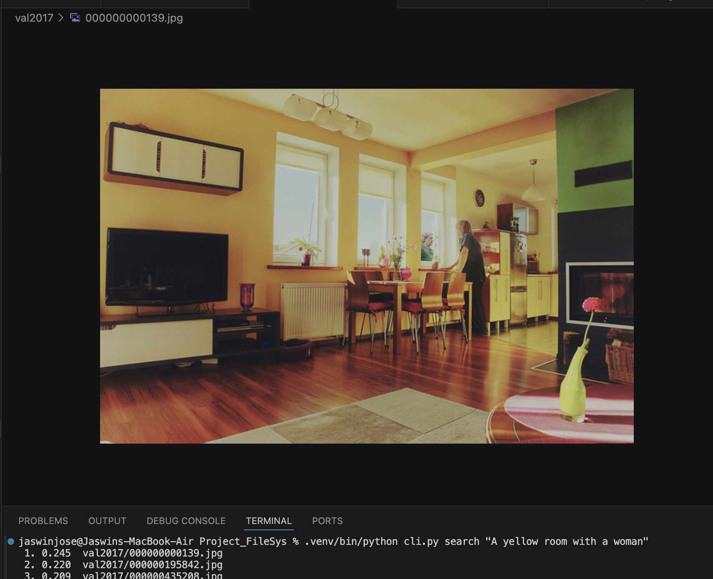

# Lumen — local multimodal file search

Search your files by *meaning*, not filename. Type "a blue fish" and every
image of a blue fish surfaces — or search by dropping in an example image.
Everything runs **fully locally**; no files leave your machine.

## How it works

Every file is turned into a vector (a point in "meaning space") using
**jina clip v1** (via `fastembed`, ONNX — no PyTorch). Text and images share one
space, so the words "blue fish" land near a photo of a blue fish. Search =
find the nearest vectors. Vectors live in **LanceDB** (embedded, on-disk,
scales to 100k+). YOLO is used for object detection.

```
query (text OR image) --> CLIP encoder --> vector --> LanceDB nearest-neighbor --> files
```

## Phase 1 (done): the engine

```bash
python3.13 -m venv .venv
.venv/bin/pip install -r requirements.txt

.venv/bin/python cli.py index  ~/Pictures      # crawl + embed images
.venv/bin/python cli.py search "a blue fish"    # search by text
.venv/bin/python cli.py similar photo.jpg       # search by example image
```

The index is stored at `~/.lumen/index`.

## Roadmap

- **Phase 2** — Electron desktop app (cross-platform UI over this engine).
- **Phase 3** — whole-system indexing: file-watching, incremental updates,
  background queue.
- **Phase 4** — more modalities: PDFs, audio (Whisper), video (frames + audio).

## Layout

```
engine/embed.py    CLIP text/image embedding (shared space)
engine/db.py       LanceDB store + schema
engine/index.py    filesystem crawl -> embed -> store
engine/search.py   text / image query -> ranked files
cli.py             command-line interface
```

## Usage
```
.venv/bin/python cli.py index <folder-to-be-indexed>
.venv/bin/python cli.py similar <path-to-image-file>
.venv/bin/python cli.py search <search-text>
.venv/bin/python cli.py failures -n 20 
```

## Test
```
curl -O http://images.cocodataset.org/zips/val2017.zip && unzip -q val2017.zip
.venv/bin/python cli.py index val2017  
.venv/bin/python cli.py search "A yellow room with a woman"      
```
### Result
